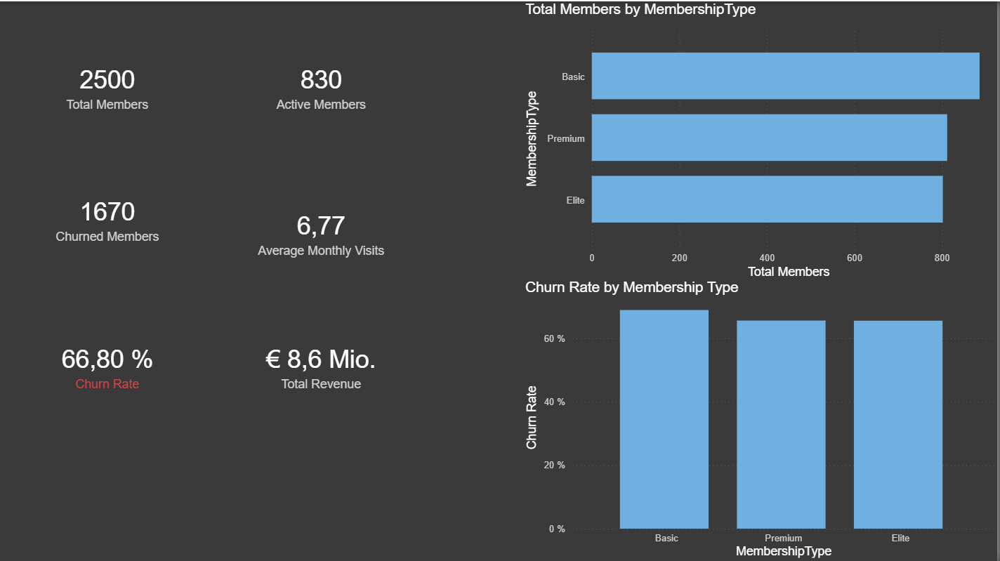
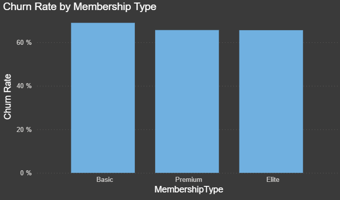
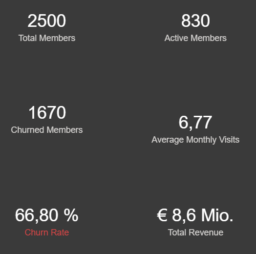

# Gym BI Analytics Dashboard 🏋️‍♂️📊

## Business Scenario
This project simulates a gym chain analyzing member retention, activity behavior, and revenue distribution.

## Objectives
- Identify churn risk
- Analyze membership distribution
- Evaluate revenue concentration through interactive visualization
- Assess activity engagement

## Tech Stack
- Python (dataset generation & preprocessing)
- SQL (star schema modeling)
- Power BI (DAX, KPI design, dashboarding)

## Key KPIs
- Total Members
- Active Members
- Churned Members
- Churn Rate (conditional risk highlighting > 50%)
- Average Monthly Visits
- Total Revenue

## Executive Insight
The churn rate of 66.8% indicates significant retention risk.
Basic membership shows the highest cancellation volume.
Revenue distribution suggests upsell opportunities in Premium tiers.

## Dashboard Preview

